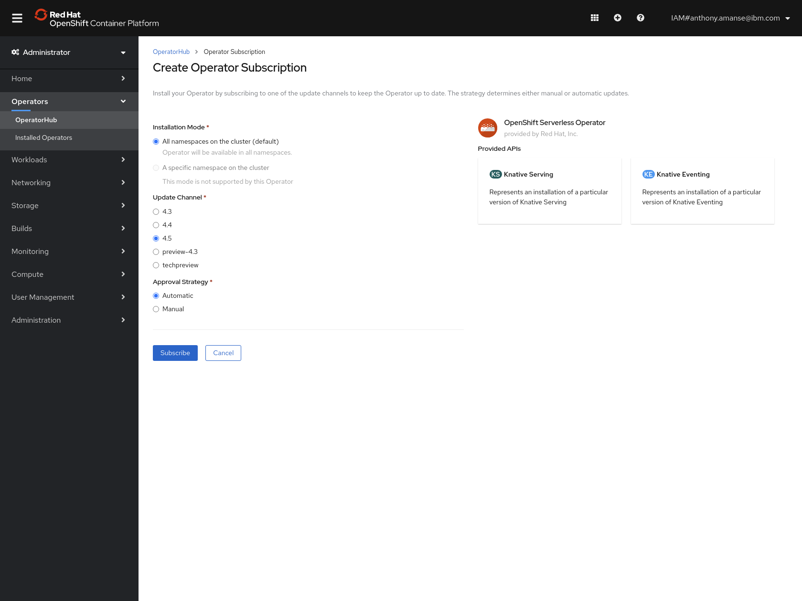

OpenShift provides a lot of functionality out of the box for developers. The use of Operators also allow developers to easily add more functionality in their own platform. This tutorial would focus on one Operator that enables OpenShift to have serverless workloads. The OperatorHub can deploy OpenShift Serverless in your own OpenShift environment. OpenShift Serverless is based on the [Knative](https://knative.dev/) project that allows the deployment of its serverless components on top of Kubernetes.

This tutorial demonstrates the process of installing OpenShift Serverless in your own OpenShift envornment. This tutorial also walks through the process of deploying the available serverless components and have serverless applications run in your platform based on events. The example in this tutorial is using a CouchDB database to demonstrate the scaling up of applications from zero when changes are made to the database.

The examples in this tutorial use [Red Hat® OpenShift® on IBM Cloud™](https://www.ibm.com/cloud/openshift).

# Prerequisite

To complete this tutorial, you need the following environment:

- A Red Hat OpenShift on IBM Cloud cluster already provisioned to enable you to set up a pipeline. If you need to create one, you can use the [IBM Cloud web console](https://cloud.ibm.com/kubernetes/catalog/cluster/create?platformType=openshift) or the `ibmcloud` CLI. When using the latter, this [tutorial](https://cloud.ibm.com/docs/openshift?topic=openshift-openshift_tutorial#openshift_create_cluster) may come in handy. NOTE: This tutorial is not compatable with Cloud Pak for Applications. You will need an empty cluster.

- OpenShift CLI `oc` which can be found [here](https://www.okd.io/download.html).

- This tutorial uses a few files from a GitHub repo. Clone the repo below.
```
$ git clone https://github.com/IBM/openshift-serverless-nodejs-couchdb
$ cd openshift-serverless-nodejs-couch
```

# Estimated time

After the prerequisites are met, this tutorial takes approximately 20 minutes to complete.

# Steps

1. [Install OpenShift Serverless](#1-install-openshift-serverless)
2. [Install CouchDB Events Source](#2-install-couchdb-events-source)
3. [Create a CouchDB and an Event Source](#3-Create-a-CouchDB-and-an-Event-Source)
4. [Build the sample nodejs serverless application](#4-Build-the-sample-nodejs-serverless-application)
5. [Deploy the serverless application](#5-Deploy-the-serverless-application)
6. [Install Broker and Trigger](#6-Install-Broker-and-Trigger)
7. [Make changes to the database](#7-Make-changes-to-the-database)

## 1. Install OpenShift Serverless

You can install the OpenShift Serverless Operator using the OperatorHub in your OpenShift dashboard. Use Update Channel version 4.5




This tutorial is using Knative Serving and Eventing. Knative serving allows you to run stateless serverless service. Knative Eventing is needed for subscriptions to event sources. 

To install Knative Serving

```
$ oc create namespace knative-serving
$ oc apply -f knative-serving.yaml
```

Make sure the status of Knative Serving is ready. This could take a few minutes.
```
$ oc get knativeserving.operator.knative.dev/knative-serving -n knative-serving --template='{{range .status.conditions}}{{printf "%s=%s\n" .type .status}}{{end}}'

DependenciesInstalled=True
DeploymentsAvailable=True
InstallSucceeded=True
Ready=True
```

Then proceed to installing Knative Eventing

```
$ oc create namespace knative-eventing
$ oc apply -f knative-eventing.yaml
```

Make sure the status of Knative Eventing is ready. This could take a few minutes.
```
$ oc get knativeeventing.operator.knative.dev/knative-eventing \
  -n knative-eventing \
  --template='{{range .status.conditions}}{{printf "%s=%s\n" .type .status}}{{end}}'


InstallSucceeded=True
Ready=True
```

## 2. Install CouchDB Events Source

Install CouchDB Events Source. This allows the serverless platform to listen for changes in a CouchDB database.

```
$ oc apply -f https://github.com/knative/eventing-contrib/releases/download/v0.15.1/couchdb.yaml
```

## 3. Create a CouchDB and an Event Source

Create a CouchDB deployment in your cluster using the yaml file provided in the repo.

```
$ oc apply -f couchdb-deployment.yaml
```

Next, you would need to create an example database in CouchDB.

You would have to expose the database for this tutorial to access it in your environment.

```
$ oc expose svc/couchdb

$ oc get routes
NAME      HOST/PORT                   PATH   SERVICES   PORT   TERMINATION   WILDCARD
couchdb   couchdb-default.***.cloud          couchdb    5984                 None
```

Access your couchdb deployment in `/_utils` path of your route (e.g. `couchdb-default.***.cloud/_utils`). Username and password is `admin` and `password` respectively.

For this tutorial, create a database called `users`. Choose `Non-partitioned` for the partitioning option.


You can now create a CouchDB event source with the `users` database. Create a secret for the credentials and create the source using the provided yaml files.

```
$ oc apply -f couchdb-secret.yaml
$ oc apply -f couchdb-source.yaml
```

## 4. Build the sample nodejs serverless application

The repo provides the source code for the sample nodejs serverless application. You can choose to build it and push it to Docker Hub.
> You can also skip this step and use the image provided in `serverless-app.yaml`

To build it, you can choose to build it using `docker` or `podman`

```
$ docker build -t <image-name> .
$ docker push <image-name>
```

Then change the image name with yours in `serverless-app.yaml`

The application uses is using [CloudEvents](https://cloudevents.io/) SDK to read events from OpenShift serverless event sources. CloudEvents is a specification for describing event data in a common way to provide interoperability across services, platforms and systems. The CloudEvents SDK for javascript is in github [cloudevents/sdk-javascript](https://github.com/cloudevents/sdk-javascript).

## 5. Deploy the serverless application

You can now deploy the sample application. This is your Knative Serving Service (usually called Knative Service).

```
$ oc apply -f serverless-app.yaml
```

You can check the deployment status using the commands below. Ready state should say True.

```
$ oc get ksvc
NAME                      URL                                                        LATESTCREATED                   LATESTREADY                     READY   REASON
process-deleted-user      http://process-deleted-user.default.svc.cluster.local      process-deleted-user-4sg8s      process-deleted-user-4sg8s      True    
process-registered-user   http://process-registered-user.default.svc.cluster.local   process-registered-user-j2b82   process-registered-user-j2b82   True    
```

There should be 2 Knative Service deployed with the same application for demo purposes later in the tutorial.

## 6. Install Broker and Trigger

The Broker and Trigger are both custom resources from OpenShift Serverless. The **Broker** represents an event mesh where it can receive events from a source. The Broker then sends the events to the subscribers which are called **Triggers**. Triggers are configured to subscribe to a Broker.

To install the broker in OpenShift serverless, you must create service accounts to make sure that the broker has sufficient permissions. Create the `serviceaccount` using the commands below.

```
$ oc -n default create serviceaccount eventing-broker-ingress
$ oc -n default create serviceaccount eventing-broker-filter
```

Create the role bindings to the service accounts

```
$ oc -n default create rolebinding eventing-broker-ingress \
  --clusterrole=eventing-broker-ingress \
  --serviceaccount=default:eventing-broker-ingress
$ oc -n default create rolebinding eventing-broker-filter \
  --clusterrole=eventing-broker-filter \
  --serviceaccount=default:eventing-broker-filter
```

Then you can install the Broker

```
$ oc apply -f broker.yaml
```

Install Triggers

```
$ oc apply -f triggers.yaml
```

If you take a look at `triggers.yaml` file, the 2 triggers are filtered to subscribe to specific CloudEvent types `org.apache.couchdb.document.update` and `org.apache.couchdb.document.delete`. The first part of the yaml file will send the event to the `process-registered-user` Knative service when a document is added or updated. The second part will send the event to the `process-deleted-user` Knative service deployed when a document is deleted.

## 7. Make changes to the database

Now you can check the status of your pods. Your serverless applications should have scaled down to zero by now. To watch the pods, you can use the command below.

<!-- watch pods -->
```
$ oc get pods -w 
```

Your serverless applications will run whenever you make changes to the database as you configured in the previous step with `triggers.yaml`

Now go back to the CouchDB dashboard (`couchdb-default.***.cloud/_utils`) and add a document in `users` database with any JSON content.


If you go back to the terminal where you executed the watch pods command, you would see that your `process-registered-user` serverless app is ran because of the update event in your serverless platform.

```
$ oc get pods -w
NAME                                                              READY   STATUS    RESTARTS   AGE
couchdb-7f88bf6d65-snfr4                                          1/1     Running   0          44h
couchdbsource-couchdb-tran-f95d5c21-5e67-47b5-adc4-65228d5cdbr8   1/1     Running   0          28s
default-broker-filter-b5967fd6c-k4tlw                             1/1     Running   0          4m29s
default-broker-ingress-558585dc6c-nbbtp                           1/1     Running   0          4m29s
process-registered-user-j2b82-deployment-78569d5444-hmp6h         0/2     Pending   0          0s
process-registered-user-j2b82-deployment-78569d5444-hmp6h         0/2     Pending   0          0s
process-registered-user-j2b82-deployment-78569d5444-hmp6h         0/2     ContainerCreating   0          0s
process-registered-user-j2b82-deployment-78569d5444-hmp6h         0/2     ContainerCreating   0          2s
process-registered-user-j2b82-deployment-78569d5444-hmp6h         0/2     ContainerCreating   0          2s
process-registered-user-j2b82-deployment-78569d5444-hmp6h         1/2     Running             0          4s
process-registered-user-j2b82-deployment-78569d5444-hmp6h         2/2     Running             0          4s

```

After a while, it should scale back down to zero. If you delete the document you just created, you should see the other serverless app `process-deleted-user` is ran.

```
process-deleted-user-4sg8s-deployment-5b75749f98-sr4sv            0/2     Pending             0          0s
process-deleted-user-4sg8s-deployment-5b75749f98-sr4sv            0/2     Pending             0          0s
process-deleted-user-4sg8s-deployment-5b75749f98-sr4sv            0/2     ContainerCreating   0          0s
process-deleted-user-4sg8s-deployment-5b75749f98-sr4sv            0/2     ContainerCreating   0          2s
process-deleted-user-4sg8s-deployment-5b75749f98-sr4sv            0/2     ContainerCreating   0          2s
process-deleted-user-4sg8s-deployment-5b75749f98-sr4sv            0/2     ContainerCreating   0          3s
process-deleted-user-4sg8s-deployment-5b75749f98-sr4sv            1/2     Running             0          3s
process-deleted-user-4sg8s-deployment-5b75749f98-sr4sv            2/2     Running             0          4s
```

The image below shows the architecture of how all the components work together.


# Summary

The OpenShift Serverless Operator allows you to have your own serverless architecture in your OpenShift platform. This enables you to have an efficient way of running your applications and also have a way to run applications based on events.

After doing this tutorial, you can now implement your own applications that benefits from the use of a serverless architecture and build it using the serverless components you just learned how to deploy.